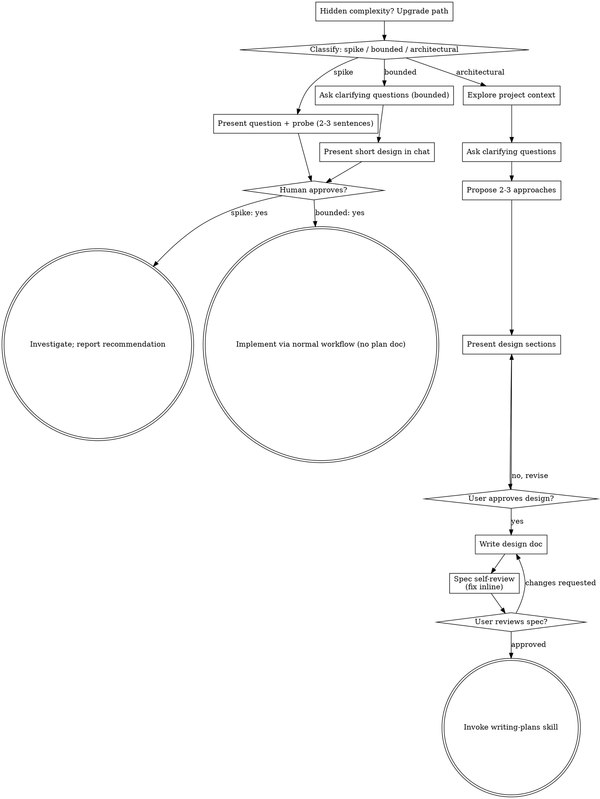

# Brainstorming Ideas Into Designs

通过自然的协作对话，将想法转化为完整的设计和 spec。

首先对请求所需的 process 程度进行分类，然后按路径推进：理解 context、 refine 想法、呈现 design，并获得 human partner 的 approval。

<HARD-GATE>
在告诉 human partner 你的意图并获得 approval 之前，不要 invoke 任何 implementation skill、编写任何 code、搭建任何
project，或采取任何 implementation action。这适用于下方每条路径上的 EVERY task — ceremony 随 task 规模变化；
approval gate 永不变化。
</HARD-GATE>

## Three Paths

在第一个问题之前，对请求分类并大声说出分类 — "this looks bounded, so I'll present a short
design here rather than write a spec" — 以便 human partner 可以 override：

- **Spike** — 可行性问题（"can we..."、"is it possible..."、
  "quick and dirty is fine"），输出是答案，不是你要保留的 code。用 2-3 句话呈现问题和你要尝试的内容，获得点头，
  然后尽可能便宜地验证正确性。无 design
  doc，无 spec file。以 recommendation 报告 findings；你构建的任何东西都标注为 throwaway。
- **Bounded** — 对 repo 中已有 code 的 well-scoped 变更：新 flag、小 endpoint、单文件 fix。
  了解 app 类型不够 — bounded 意味着你要改的 flow 已经在这里可读。如果没有 existing
  flow 可改，任务不是 bounded。问重要的 clarifying
  questions，在 CHAT 中呈现 short design（几句话到几段短文字），然后 STOP。Implementation
  仅在 human partner 对该 design 说 yes 后开始 — bounded task 的 approval 与 architectural
  一样 hard gate。无 spec file，无 implementation plan document。
- **Architectural** — 新项目、新 subsystems、重构 components 如何组合或改变他人依赖的 interfaces 的变更。遵循完整 process：questions、approaches、sectioned
  design、written spec，然后 writing-plans skill。

在两个 path 之间不确定时，选更重的那个。Ratchet 是
单向的：mid-task 发现的 hidden complexity 升级 path —
stop，说明情况，并 step up。Mid-task 不会 downgrade。

## Anti-Pattern: "Too Simple To Need Approval"

每条 path 都以 human partner 在 implementation 前 approving 你的 intent 结束。Todo list、单函数 utility、config
change — design 可以是 chat 中两句话，但你 MUST present
它并获得 approval。"Simple" tasks 是 unexamined assumptions
造成最多 wasted work 的地方。随 simplicity 变化的是
artifact，never the approval。

## Red Flags

| Thought | Reality |
|---------|---------|
| "This is too simple to need a design" | Simple 意味着 short design，不是 no design。Chat 中两句话，然后 approval。 |
| "I'll call it bounded and skip the spec" | 用 label 跳过 work 就是 doubt — 选更重的 path。 |
| "It's bounded and the design is obvious — I'll start while they read it" | Gate 是 approval，不是 design 长度。Present，然后 stop 直到听到 yes。 |
| "I understand this kind of app, so it's bounded" | Bounded 衡量 repo，不是你的熟悉度。新项目没有 existing flow — 它是 architectural。 |
| "The spike works, so I'll keep the code" | Spike 的输出是答案。保留 code 是新请求 — 重新分类。 |
| "It grew, but I'm almost done — no need to re-classify" | Hidden complexity mid-task 升级 path。Stop 并说明。 |
| "They approved the spike, so the follow-up change is approved too" | 每个 task 有自己的 classification 和 approval。 |

## Checklist

先分类，announce path，然后为 path 上每一项创建 task 并按顺序完成。

**Spike:**
1. **Explore project context** — 足够 framing the probe
2. **Present question + probe plan** — 2-3 句话
3. **Get approval** — 点头即可
4. **Investigate** — 尽可能便宜地保证正确性
5. **Report findings** — recommendation；将构建的任何东西标注为 throwaway

**Bounded:**
1. **Explore project context** — 检查 files、docs、recent commits
2. **Ask clarifying questions** — 一次一个，问重要的
3. **Present short design in chat** — approach、files touched、testing
4. **Get approval** — STOP 并等待 explicit yes；present design 与 start 同一口气就是跳过 gate
5. **Implement** — 按正常 development workflow 进行（TDD 适用）；无 plan document

**Architectural:**
1. **Explore project context** — 检查 files、docs、recent commits
2. **Offer the visual companion just-in-time** — 不要 upfront。第一次有问题 genuinely 更适合展示而非描述时再 offer（单独一条消息）；approval 后其 browser tab 为你打开。如果没有 visual question 出现，never offer。见下方 Visual Companion section。
3. **Ask clarifying questions** — 一次一个，理解 purpose/constraints/success criteria
4. **Propose 2-3 approaches** — 含 trade-offs 和你的 recommendation
5. **Present design** — 按复杂度分 section，每 section 后获得 user approval
6. **Write design doc** — 保存到 `docs/superpowers/specs/YYYY-MM-DD-<topic>-design.md` 并 commit
7. **Spec self-review** — 快速 inline 检查 placeholders、contradictions、ambiguity、scope（见下方）
8. **User reviews written spec** — 继续前请 user review spec file
9. **Transition to implementation** — invoke writing-plans skill 创建 implementation plan

## Process Flow

**Terminal states 与 path 绑定。** Architectural：brainstorming 之后 ONLY invoke 的 skill 是 writing-plans — never frontend-design、
mcp-builder 或任何其他 implementation skill。Bounded：approval 后
implementation 直接通过正常 development workflow；无 plan document。Spike：terminal state 是
reported recommendation。

## The Process

下方 subsections 服务于 bounded 和 architectural paths（spike 在 "present the probe, get a nod" 停止）。从
**Exploring approaches** 起的 sections 是 architectural-path 深度 — 对于
bounded work，context 加几个问题加 short in-chat design
就是完整 process。

**Understanding the idea:**

- 先查看当前 project state（files、docs、recent commits）
- 在问详细问题之前，评估 scope：如果请求描述多个独立 subsystems（例如 "build a platform with chat, file storage, billing, and analytics"），立即 flag。不要花问题 refine 需要先 decompose 的项目的细节。
- 如果项目对单个 spec 太大，帮助 user decompose 为 sub-projects：有哪些独立 pieces、如何关联、应按什么顺序构建？然后对第一个 sub-project 走正常 design flow。每个 sub-project 有自己的 spec → plan → implementation cycle。
- 对于 scope 合适的项目，一次一个问题 refine 想法
- 尽可能用 multiple choice questions，open-ended 也可以
- 每条消息只一个问题 — 如果 topic 需要更多探索，拆成多个问题
- 聚焦理解：purpose、constraints、success criteria

**Exploring approaches:**

- 提出 2-3 种不同 approaches 及 trade-offs
- 对话式呈现 options，含 recommendation 和 reasoning
- 先 lead with recommended option 并解释原因
-  ruthlessly YAGNI — 从每个 approach 和 design 中移除 unnecessary features

**Presenting the design:**

- 一旦相信理解了要构建的内容，present design
- 每个 section 按复杂度 scaling：straightforward 则几句话，nuanced 则最多 200-300 words
- 每个 section 后问是否看起来正确
- 覆盖：architecture、components、data flow、error handling、testing
- 如有不清楚，准备回去 clarify

**Design for isolation and clarity:**

- 将系统拆成更小 units，每个有 one clear purpose，通过 well-defined interfaces 通信，可独立理解和测试
- 对每个 unit，应能回答：它做什么、如何使用、依赖什么？
- 能否不读 internals 就理解 unit 做什么？能否改 internals 而不破坏 consumers？如果不能，boundaries 需要 work。
- 更小、well-bounded 的 units 也更容易工作 — 你 reason 更好 about 能一次 hold in context 的 code，files focused 时 edits 更可靠。File 变大往往是 doing too much 的信号。

**Working in existing codebases:**

- 在 propose changes 之前 explore 当前 structure。Follow existing patterns。
- 现有 code 有问题且影响工作时（例如 file 太大、boundaries 不清、tangled responsibilities），将 targeted improvements 纳入 design — 就像 good developer 改进正在工作的 code。
- 不要 propose unrelated refactoring。Stay focused on 服务当前 goal 的内容。

## After the Design (architectural path)

**Documentation:**

- 将 validated design（spec）写入 `docs/superpowers/specs/YYYY-MM-DD-<topic>-design.md`
  - （User 对 spec location 的偏好 override 此 default）
- 若可用，使用 elements-of-style:writing-clearly-and-concisely skill
- 将 design document commit 到 git

**Spec Self-Review:**
写完 spec document 后，fresh eyes 审视：

1. **Placeholder scan:** 任何 "TBD"、"TODO"、不完整 sections 或 vague requirements？Fix them。
2. **Internal consistency:** 任何 sections 互相矛盾？Architecture 是否匹配 feature descriptions？
3. **Scope check:** 是否 focused enough 用于单个 implementation plan，还是需要 decomposition？
4. **Ambiguity check:** 任何 requirement 能否被两种不同方式解读？若能，pick one 并 make explicit。

Inline fix issues。无需 re-review — fix and move on。

**User Review Gate:**
spec review loop 通过后，请 user review written spec 再继续：

> "Spec written and committed to `<path>`. Please review it and let me know if you want to make any changes before we start writing out the implementation plan."

等待 user response。若 request changes，修改并 re-run spec review loop。仅当 user approves 后继续。

**Implementation:**

- Invoke writing-plans skill 创建 detailed implementation plan
- 不要 invoke 任何其他 skill。writing-plans 是 next step。

## Visual Companion

Browser-based companion，用于 brainstorming 期间展示 mockups、diagrams 和 visual options。作为 tool 可用 — 不是 mode。Accepting companion 意味着它对 benefit from visual treatment 的问题可用；NOT 意味着每个问题都走 browser。

**Offering the companion (just-in-time):** 不要 upfront offer。等到问题 genuinely 更适合 shown than told — 真正的 mockup / layout / diagram 问题，而不仅是 UI *topic*。第一次发生时再 offer，作为单独消息：
> "This next part might be easier if I show you — I can put together mockups, diagrams, and comparisons in a browser tab as we go. It's still new and can be token-intensive. Want me to? I'll open it for you."

**此 offer MUST 是单独消息。** 只有 offer — 无 clarifying question、summary 或其他内容。等待 user response。若 accept，用 `--open` 启动 server，browser 自动打开 first screen。若 decline，继续 text-only，除非 user 提起否则不再 offer。

**Per-question decision:** 即使用户 accept 后，对每个问题 FOR EACH QUESTION 决定用 browser 还是 terminal。Test：**would the user understand this better by seeing it than reading it?**

- **Use the browser** 用于 IS visual 的内容 — mockups、wireframes、layout comparisons、architecture diagrams、side-by-side visual designs
- **Use the terminal** 用于 text 内容 — requirements questions、conceptual choices、tradeoff lists、A/B/C/D text options、scope decisions

关于 UI topic 的问题不自动是 visual question。"What does personality mean in this context?" 是 conceptual question — 用 terminal。"Which wizard layout works better?" 是 visual question — 用 browser。

若 agree to companion，继续前阅读详细 guide：
`skills/brainstorming/visual-companion.md`
