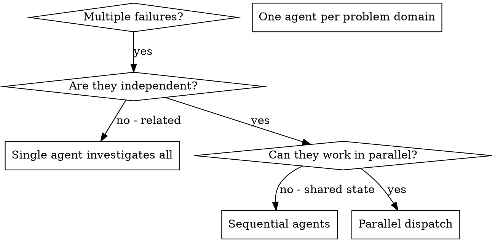

# Dispatching Parallel Agents

## Overview

你将 task delegate 给 specialized agent，context 隔离。通过精确 crafting 它们的 instruction 与 context，确保它们 stay focused 并成功完成 task。它们 never 继承你的 session context 或 history——你构造它们所需的一切。这也 preserve 你自己的 context 供 coordination 工作。

当你有多个 unrelated failure（不同 test file、不同 subsystem、不同 bug），sequential 调查浪费时间。每个 investigation 独立，可 parallel 进行。

**Core principle:** 每个 independent problem domain dispatch 一个 agent。让它们 concurrent 工作。

## When to Use



**Use when:**
- 3+ test file 失败，root cause 不同
- 多个 subsystem 独立 broken
- 每个 problem 无需其他 context 即可理解
- Investigation 之间无 shared state

**Don't use when:**
- Failure 相关（fix 一个可能 fix 其他）
- 需要理解 full system state
- Agent 会互相 interfere

## The Pattern

### 1. Identify Independent Domains

按 broken 内容分组 failure：
- File A tests: Tool approval flow
- File B tests: Batch completion behavior
- File C tests: Abort functionality

每个 domain 独立——fix tool approval 不影响 abort tests。

### 2. Create Focused Agent Tasks

每个 agent 获得：
- **Specific scope:** 一个 test file 或 subsystem
- **Clear goal:** 让这些 tests pass
- **Constraints:** Don't change other code
- **Expected output:** 你发现并 fix 了什么的 summary

### 3. Dispatch in Parallel

在同一 response 中发出全部三个 subagent dispatch——它们 parallel 运行：

```text
Subagent (general-purpose): "Fix agent-tool-abort.test.ts failures"
Subagent (general-purpose): "Fix batch-completion-behavior.test.ts failures"
Subagent (general-purpose): "Fix tool-approval-race-conditions.test.ts failures"
# All three run concurrently.
```

同一 response 中多个 dispatch call = parallel execution。每个 response 一个 = sequential。

### 4. Review and Integrate

When agents return:
- Read each summary
- Verify fix 不 conflict
- Run full test suite
- Integrate all changes

## Agent Prompt Structure

Good agent prompt：
1. **Focused** - 一个 clear problem domain
2. **Self-contained** - 理解 problem 所需的全部 context
3. **Specific about output** - agent 应 return 什么？

```markdown
Fix the 3 failing tests in src/agents/agent-tool-abort.test.ts:

1. "should abort tool with partial output capture" - expects 'interrupted at' in message
2. "should handle mixed completed and aborted tools" - fast tool aborted instead of completed
3. "should properly track pendingToolCount" - expects 3 results but gets 0

These are timing/race condition issues. Your task:

1. Read the test file and understand what each test verifies
2. Identify root cause - timing issues or actual bugs?
3. Fix by:
   - Replacing arbitrary timeouts with event-based waiting
   - Fixing bugs in abort implementation if found
   - Adjusting test expectations if testing changed behavior

Do NOT just increase timeouts - find the real issue.

Return: Summary of what you found and what you fixed.
```

## Common Mistakes

**❌ Too broad:** 「Fix all the tests」- agent gets lost
**✅ Specific:** 「Fix agent-tool-abort.test.ts」- focused scope

**❌ No context:** 「Fix the race condition」- agent doesn't know where
**✅ Context:** Paste error messages and test names

**❌ No constraints:** Agent might refactor everything
**✅ Constraints:** 「Do NOT change production code」or 「Fix tests only」

**❌ Vague output:** 「Fix it」- you don't know what changed
**✅ Specific:** 「Return summary of root cause and changes」

## When NOT to Use

**Related failures:** Fix 一个可能 fix 其他——先一起 investigate
**Need full context:** 理解需要看 entire system
**Exploratory debugging:** 你还不知道 broken 什么
**Shared state:** Agent 会 interfere（edit 同一 file、用同一 resource）

## Real Example from Session

**Scenario:** Major refactoring 后 3 个 file 共 6 个 test failure

**Failures:**
- agent-tool-abort.test.ts: 3 failures (timing issues)
- batch-completion-behavior.test.ts: 2 failures (tools not executing)
- tool-approval-race-conditions.test.ts: 1 failure (execution count = 0)

**Decision:** Independent domains - abort logic 与 batch completion 与 race conditions 分离

**Dispatch:**
```
Agent 1 → Fix agent-tool-abort.test.ts
Agent 2 → Fix batch-completion-behavior.test.ts
Agent 3 → Fix tool-approval-race-conditions.test.ts
```

**Results:**
- Agent 1: Replaced timeouts with event-based waiting
- Agent 2: Fixed event structure bug (threadId in wrong place)
- Agent 3: Added wait for async tool execution to complete

**Integration:** All fixes independent, no conflicts, full suite green

## Verification

After agents return:
1. **Review each summary** - 理解改了什么
2. **Check for conflicts** - Agent 是否 edit 同一 code？
3. **Run full suite** - Verify 所有 fix 一起 work
4. **Spot check** - Agent 可能犯 systematic error
