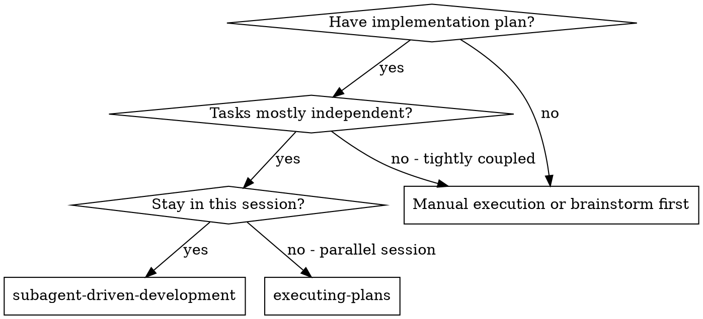
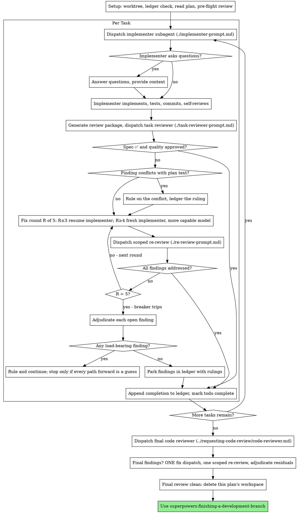

# Subagent-Driven Development

通过为每个 task dispatch 新的 implementer subagent、每个 task 之后做 task review（spec compliance + code quality）、最后做 broad whole-branch review 来 execute plan。

**Why subagents:** 你将 task delegate 给 specialized agent，context 隔离。通过精确 crafting instruction 与 context，确保它们 stay focused 并成功完成 task。它们 never 继承你的 session context 或 history——你构造它们所需的一切。这也 preserve 你自己的 context 供 coordination 工作。

**Core principle:** 每个 task 用 fresh subagent + task review（spec + quality）+ broad final review = high quality, fast iteration

**Narration:** tool call 之间，最多 narrate 一行短句——
ledger 与 tool result 承载记录。

**Continuous execution:** 不要在 task 之间 pause 向 your human partner check in。Execute plan 中所有 task 不停止。只有下面四个 named reason，或全部 task 完成，才停止。「Should I continue?」prompt 与 progress summary 浪费他们时间——他们让你 execute plan，就 execute。

**Rulings, not stalls.** Running plan 不等待 human。Conflicts、
ambiguities、plan defects、你会 ask 是否 exceed 的 cap——由你
决定。Spec 是 binding authority，plan 是它的 argument，你的
judgment 解决两者都答不了的事。每个决定记入 ledger：
`Ruling: <what you decided> — <why> — <what it costs if wrong>`，然后
继续。Wrong ruling 的 rework 你的 human partner 能看见并 undo；
session 停在 question 上浪费他们整天却一无所获。

Four things stop you, and only these: irreversible 或 destructive
operation；security-sensitive action；worktree 外、norms 要求先 ask 的 side effect（merge、push 到 shared branch、
publish）；plan 如此 broken 以至于每条 forward path 都是 guess。这些情况
stop and ask。

## When to Use



**vs. Executing Plans (parallel session):**
- Same session（无 context switch）
- 每个 task fresh subagent（无 context pollution）
- 每个 task 后 review（spec compliance + code quality），最后 broad review
- Faster iteration（task 之间无 human-in-loop）

## The Process



## Setup

Ensure 工作在 isolated workspace：用
superpowers:using-git-worktrees 创建或 verify 现有 worktree。
Never 在 main/master branch 上 start implementation，除非 your human
partner explicit consent。

Conversation memory 不 survive compaction。Real session 中，
失去位置的 controller 曾 re-dispatch 整个已完成 task 序列——观测到最昂贵的 single failure。在 ledger file 中 track progress，不只 todos。

- 每个 plan 拥有 workspace：skill start 时 run 本 skill 的
  `scripts/sdd-workspace PLAN_FILE`——打印 plan 的 git-ignored
  directory（`<repo-root>/.superpowers/sdd/<plan-basename>/`），home 于
  本 plan 的每个 artifact：ledger、briefs、reports、review packages。
  另一个 plan 的 directory never 是你的 read/write 范围。
- 检查本 plan ledger 于 `<workspace>/progress.md`。若 first
  line 命名你的 plan file，带 `Task <N>: complete` 行的 task 是 DONE
  —— 不要 re-dispatch；resume 于第一个没有该行的 task。Last line 是 fix round 的 task 在 loop 中：resume 于 next
  round。First line 命名不同 plan file 的 ledger——或 flat path `.superpowers/sdd/progress.md` 的 stray
  ledger——是另一 plan 的 progress：leave in place，start 自己的 fresh。
- 创建 ledger，identity 为 first line：
  `# SDD ledger — plan: <plan file path>`。
- Ledger 是你的 recovery map：它命名的 commit 在 git 中存在，即使
  context 不再记得创建它们。Compaction 后，
  trust ledger 与 `git log` 胜过自己的 recollection。
- `git clean -fdx` 会 destroy workspace（git-ignored scratch）；若
  发生，从 `git log` recover。

Read plan once，note context 与 Global Constraints，create
todo per task。若 plan 命名 Spec，也 read：spec 是 plan argue 的
authority，plan 内 conflict 依 spec resolve。
无 reachable spec 的 plan 在 ledger note——
无 spec 的 ruling 是 provisional。

Dispatch Task 1 前，scan plan once 找 conflict，check 时写下
你检查了什麼：

- 互相矛盾或与 plan Global Constraints 矛盾的 task
- plan explicitly mandate 但 review rubric 当 defect 的任何东西（assert nothing 的 test、logic block 的 verbatim duplication）

Scan 输出是 table，不是 verdict。共享 file 或 interface 的每对 task 一行：两个 task、一个产出什么另一个 consume 什么、你发现什么。每个 task 一行：其 text 是否自洽——指定的 test 对指定的 code、创建的 file 对 later touch 的 file。「The scan is clean」没有这些 row 不是跑过的 scan。

Write table 到 ledger。Execution
开始前 rule 你发现的一切——每个 finding 对 mandate 它的 plan text——每个 ruling 记入 ledger。Scan clean 则 proceed without comment。
Rule 每个 surfaced conflict——spec 是 binding authority，plan 是它的 argument——ruling  beside row，dispatch
Task 1。Review loop 仍是仅 implementation 才 emerge 的 conflict 的 net。

## Model Selection

Use least powerful model 处理每个 role，省 cost 增 speed。

**Mechanical implementation tasks**（isolated function、clear spec、1-2 file）：用 fast, cheap model。Plan well-specified 时大多数 implementation 是 mechanical。

**Integration and judgment tasks**（multi-file coordination、pattern matching、debugging）：用 standard model。

**Architecture and design tasks**：用 most capable available model。
Final whole-branch review 是其中之一——dispatch 于 most
capable available model，不是 session default。

**Review tasks**：选同样 judgment、按 diff size、complexity、risk scale 的 model。Small mechanical diff 不需要 most capable；subtle concurrency change 需要。Small fix diff 的 scoped re-review 用 cheap-to-mid tier。

**Fix-loop escalation (rounds 4-5)**：用至少比 stuck implementer 高 one tier 的 model。

**Always specify model explicitly when dispatching subagent。**Omitted model 继承 session model——常为 most capable 且
most expensive——静默 defeat 本节。

**Turn count beats token price.** Wall-clock 与 context cost 随 subagent turn 数 scale，最便宜 model 在 multi-step 上 routinely 多 2-3× turn——overall 更贵。Reviewer 与从 prose description 工作的 implementer 用 mid-tier model 作
floor。Task plan text 含 complete code to write 时，
implementation 是 transcription plus testing：该 implementer 用 cheapest tier。Single-file mechanical fix 也 cheapest tier。

**Task complexity signals (implementation tasks):**
- 1-2 file、complete spec → cheap model
- 多 file、integration concern → standard model
- 需 design judgment 或 broad codebase understanding → most capable model

## The Task Loop

**Batch small same-shape work.** Plan 列出多个 task，每个是
同 kind 的 small independent edit——同一 one-line fix、
constant change 或 field addition 跨 file 重复——不要
one subagent per task。Compose ONE dispatch brief 列每个 file 与
其 change，整 batch 给 single subagent，review 其 diff
as one unit。Reserve one-dispatch-per-task 给需 own
judgment、own test 或 own review surface 的工作。

Paste 进 dispatch prompt 的一切——subagent
print 回来的一切——resident 在你 context 至 session 结束，
later turn 重读。Hand artifact 为 file。

**Waiting on dispatched subagents:** never poll wait interface 用
short timeout，也 never 一个 silent open-ended wait。
有 local work——ledger update、package next review、
read report——继续工作；child result 自行 arrive。
Genuinely idle 时，bounded stretch 等待（五到十分钟，platform 允许处），stretch 之间 post one
line status 并 reconcile live children：list，chase
finished 未 report 的。Bounded stretch 保留 long wait 几乎全部
efficiency，同时保证 stuck 或 lost
child 在 minutes 内被 notice，不是 session 结束。

### 1. Dispatch the implementer

Dispatch 前 record BASE (`git rev-parse HEAD`)——review package
与 fix-round diff 需要它。

- **Task brief:** dispatch implementer 前，run 本 skill 的
  `scripts/task-brief PLAN_FILE N`——提取 task full text 到
  uniquely named file 并 print path。Compose dispatch 使
  brief 保持 single source of
  requirements。Dispatch 应含：(1) 一行 task 在项目中的位置；(2) brief path，introduced 为「read this
  first — it is your requirements, with the exact values to use verbatim」；(3) brief 无法
  知道的 earlier task 的 interface 与 decision；(4) brief 中 ambiguity 的 resolution；(5) report-file path 与 report contract。Exact values（numbers、
  magic strings、signatures、test cases）只在 brief。Never
  make subagent read whole plan file。
- **Report file:** implementer report file 命名 follow brief
  （brief `…/task-N-brief.md` → report `…/task-N-report.md`）并 put in
  dispatch prompt。Implementer 写 full report 到那里，
  return 仅 status、commits、one-line test summary、concerns。
- Dispatch prompt 描述 one task，不是 session history。不要
  paste 累积 prior-task summary（「state after Tasks 1-3」）到
  later dispatch——real session dispatch 达 42k chars，99%
  是 pasted history。Fresh subagent 需要 task、touch 的 interface、
  global constraints。Nothing else。
- Dispatch 带 no-subagents contract（在
  implementer template）：implementer never dispatch subagent——
  不是 helper，never reviewer。Review 来自你，report 之后。Real session，worker spawn 的每个 reviewer duplicate 了 controller dispatch 的 task review——每 task 多 full extra
  review seat。
- Earlier task 在 area park finding，dispatch 带 pointer 到 ledger entry。
- Record implementer agent identity 从 dispatch result——
  fix-loop rounds 1-3 resume 此 agent。
- Never parallel dispatch 多个 implementation subagent（conflict）。

Template: [implementer-prompt.md](implementer-prompt.md)

### 2. Handle the report

Implementer subagent report 四种 status 之一。Appropriately handle：

**DONE:** Generate review package（`scripts/review-package PLAN_FILE BASE HEAD`，本 skill directory——print 写的 unique file path；BASE 是 dispatch implementer 前记录的 commit——never `HEAD~1`，会静默 drop multi-commit task 除 last 外全部 commit），然后 dispatch task reviewer 用 printed path。

**DONE_WITH_CONCERNS:** Implementer 完成但 flag doubt。Proceed 前 read concerns。Concern 关于 correctness 或 scope，address 再 review。若是 observation（如「this file is getting large」），note 并 proceed to review。

**NEEDS_CONTEXT:** Implementer 需要未提供的 information。Provide missing context 并 re-dispatch。

**BLOCKED:** Implementer 无法完成 task。Assess blocker：
1. Context problem → provide more context，same model re-dispatch
2. 需更多 reasoning → more capable model re-dispatch
3. Task 太大 → break smaller
4. Plan 本身 wrong → rule correction，ledger，re-dispatch 带 ruling

**Never** ignore escalation 或 force same model retry 无 change。Implementer 说 stuck，something 需 change。

Implementer ask question——before start 或 mid-task——answer
clearly completely，provide additional context，don't
rush into implementation。

### 3. Review the task

Per-task review 是 task-scoped gate。Broad review 一次，在
final whole-branch review。Never skip task review，never accept
缺任一 verdict 的 report——spec compliance AND task quality 都
required。Implementer self-review never 替代 task review；两者
needed。

- Hand reviewer diff as file：run 本 skill 的
  `scripts/review-package PLAN_FILE BASE HEAD`，pass reviewer file path
  it prints（或，无 bash：`git log --oneline`、`git diff --stat`、
  `git diff -U10` for range，redirect 到 one uniquely named
  file）。Output never 进入 own context，reviewer 一次 Read 见
  commit list、stat summary、full diff with context。Use dispatch implementer 前记录的 BASE——
  never `HEAD~1`，会静默 truncate multi-commit task。Never
  dispatch task reviewer 无 diff file。
- **Reviewer inputs:** task reviewer 得三个 path——同一 brief
  file、report file、review package——加 bind task 的 global
  constraints。
- Global-constraints block 是 reviewer 的 attention
  lens。Verbatim copy plan Global
  Constraints 或 spec 的 binding requirements：exact values、exact formats、
  stated component 关系（「same layout as X」、「matches
  Y」）。Reviewer template 已带 process rules（YAGNI、
  test hygiene、review method）——constraints block 是 THIS
  project spec 要求的。
- 不要加 open-ended directive 如「check all uses」或「run race tests
  if useful」无 concrete task-specific reason
- 不要 ask reviewer re-run implementer 已在 same code 上跑的 test——implementer report 带 test evidence
- 不要 pre-judge findings——never instruct reviewer
  ignore 或 not flag specific issue。Believe finding 是 false positive，let reviewer raise，review
  loop adjudicate。Prompt 含「do not flag」、「don't treat X
  as a defect」、「at most Minor」、「the plan chose」——stop：你在
  pre-judging，常为 spare review loop。
Task reviewer 可 report 「⚠️ Cannot verify from diff」——requirement
在 unchanged code 或 span task。不 block review 其余，但 mark task
complete 前必须 resolve 每项——你 hold plan 与 cross-task context reviewer
缺。Confirm real gap → failed spec
review——进 fix loop 与其他 finding。

Template: [task-reviewer-prompt.md](task-reviewer-prompt.md)

### 4. The fix loop

Loop 在 review report spec ❌、任何 Critical 或 Important
finding、或你 confirm 为 real gap 的 ⚠️ 时 trigger。

Loop start 前，两 route 立刻离开：

- Minor finding 记入 progress ledger（
  `Task <N>: minor (deferred): <one-liner>`），point final
  whole-branch review 到该 list 以便 triage merge 前必须 fix 的。Roll-up 无人读是 silent discard。Minor never 进 loop。
- Label plan-mandated 的 finding——或 conflict plan text require 的——由你 rule：weigh finding
  against plan text，spec 为 binding authority decide，ledger ruling 再 act。不要因 plan mandate dismiss finding，也不要无 recorded ruling dispatch  contradict plan 的 fix。
其余进 loop。Fix round 是 one fix dispatch plus one
scoped re-review。每 task 最多五 round：

**Rounds 1-3 — resume original implementer。**Send open findings
verbatim。Context intact：知 task、code、own
choices。Harness 不能 send another message 到 live subagent，
dispatch fresh implementer 带 brief path、report-file path、
findings——report file 是 persistent memory either way。

**Rounds 4-5 — dispatch fresh implementer on more capable model**（per
Model Selection），带 brief path、report-file path、open
findings、framing：「A prior implementer attempted this task
[N] times; you own it now. Read the report file for what was tried.」Survive three resume 的 loop 通常 mean implementer 看不见
own problem——fresh eyes 与 capability bump 一步。

**Every round, either way:** implementer fix，re-run cover amended code 的 test，append fix report 到 same report file，
return short contract。Re-dispatch reviewer 前 confirm
fix report 含 covering tests、command run、
output；三者齐再 dispatch re-review。Fix message 命名
covering test file——one-line fix 不需 whole suite。

**Re-review scoped。**Run `scripts/review-package PLAN_FILE FIX_BASE HEAD`
FIX_BASE 是 previous review 看到的 head，dispatch
[re-review-prompt.md](re-review-prompt.md) 带 findings list、
brief、report file、printed diff path。Re-reviewer verdict 每个 finding ADDRESSED 或 NOT ADDRESSED，flag fix diff 中 new breakage。Fix diff 中 new Critical/Important breakage 加入 open
findings list。Out-of-scope observation 进 ledger 作 deferred
minors——never extend loop。

**After each round,** append ledger：
`Task <N>: fix round <R>/5 (<X> addressed, <Y> open — <finding one-liners>; commits <a7>..<b7>)`

Never 在 controller session 自己 fix finding——context stay
clean for coordination，controller fix skip review。

**The breaker.** Round 5 re-review 仍 leave findings open，stop
dispatching。Adjudicate 每个 open finding——你 hold plan 与
reviewer 缺的 cross-task context：

- **Reviewer wrong 或 contestable：**park——
  `Task <N>: parked — <finding> — Ruling: <why the code stands>`。Final
  review 见双方。
- **Real 但 nothing downstream builds on it：**同样 park，
  ruling 说 real and deferred。
- **Real and load-bearing**——later task builds on it，或 reveal plan
  defect：rule smallest change unblock dependent work，
  ledger `Task <N>: Ruling: <finding> — <what you decided and why>`，
  carry 到 next task dispatch。Park structural failure
  silently 让每个 dependent task build on it。Stop 仅当 defect
  使 every path forward guess。

Adjudicate 仅在 cap。Earlier adjudicate 结束 loop 是
pre-judging 换名。每个 adjudication 是 ledger entry——
silent discard forbidden。

### 5. Complete the task

Review clean——或 cap 处每个 open finding parked with
ruling——append completion line 到 ledger，same
message 与其他 bookkeeping：

- `Task <N>: complete (commits <base7>..<head7>, review clean)`
- `Task <N>: complete (commits <base7>..<head7>, <K> parked)` after
  tripped breaker

Then mark todo complete move on。Never move next task while
review 有 open Critical/Important 既未 fixed 也未 cap parked-with-ruling。

## Final Review

Final whole-branch review 也得 package：run
`scripts/review-package PLAN_FILE MERGE_BASE HEAD`（MERGE_BASE = branch started from 的 commit，如 `git merge-base main HEAD`），include
printed path 于 final review dispatch，final reviewer 读
one file 而非 git 重 derive branch diff。Dispatch
于 most capable available model（见 Model Selection），用
superpowers:requesting-code-review 的
[code-reviewer.md](../requesting-code-review/code-reviewer.md)。Point 于 ledger deferred-minor 与 parked lines 以便 triage merge 前必须 fix 的。

Final whole-branch review return findings，dispatch ONE fix subagent
带 complete findings list——不是 one fixer per finding。
Per-finding fixer 各 rebuild context re-run suite；real
session final-review fix wave 比所有 task 合计更贵。
Then exactly one scoped re-review of fix wave
（`scripts/review-package PLAN_FILE FIX_BASE HEAD` over fix range，
[re-review-prompt.md](re-review-prompt.md)）。
Adjudicate residual findings 如 task loop breaker：park with
rulings，或 rule load-bearing 并 ledger decided。Only
上面 four classes stop you。No second fix wave——
residual load-bearing findings surface 给 human partner when
finishing-a-development-branch present options。

## Finish

Delete 任何东西前，collect 每个含 `Ruling:` 的 ledger line——
preflight rulings、parked findings、breaker adjudications，全部——到
final message 「Rulings I made」下，按做出顺序，each
带 wrong 的 cost。List exhaustive：ledger 有 ruling，list 有。List 是 decision 到达 human partner 的唯一处——他们 read 并 rework
你错的。Ruling 随 workspace 消失是 secret decision。

Final whole-branch review clean 且 fix merged，
delete 本 plan workspace（`rm -rf <workspace>`）——git history 是
record now。Sibling directory 属 other plan；leave
alone。

Use superpowers:finishing-a-development-branch.

## Common Rationalizations

| Excuse | Reality |
|--------|---------|
| 「Close enough on spec compliance」 | Reviewer 发现 spec gap = not done。Fix 或 hit cap adjudicate——唯二 exit。 |
| 「I'll fix it myself, dispatching is overhead」 | Controller fix pollute context skip review。Resume implementer。 |
| 「One more round will converge」 | Past cap，round 不 converge——failure 是 structural。Adjudicate and route。 |
| 「The reviewer will just find something new anyway」 | Scoped re-review verify fix；不能 wander。Untouched code 新 finding 进 ledger，不进 loop。 |
| 「This finding is obviously wrong, I'll drop it」 | Adjudicate 仅在 cap，每个 ruling 是 ledger entry。Silent discard forbidden。 |
| 「The fix was small, skip the re-review」 | Unreviewed fix 是 regression 入口。每 round 以 scoped re-review 结束。 |
| 「Reviews slow the loop down」 | Loop 无 review 只是 unverified churn。Review 是 loop 的 brake 与 steering。 |
| 「Ledger bookkeeping is overhead」 | Ledger survive compaction。无 ledger controller re-dispatch 整个 completed task sequence。 |
| 「The implementer spawned its own reviewer — free extra assurance」 | Duplicate seat review same diff；task review 是 gate。Worker-spawned reviewer 是 defect to flag，不是 rigor。 |

## Example Workflow

```
You: I'm using Subagent-Driven Development to execute this plan.

[Setup: worktree verified]
[Read plan file once: docs/superpowers/plans/feature-plan.md]
[Resolve workspace: scripts/sdd-workspace docs/superpowers/plans/feature-plan.md — no ledger inside, fresh start]
[Create todos for all tasks]

Task 1: Hook installation script

[Run task-brief for Task 1; dispatch implementer with brief + report paths + context]

Implementer: "Before I begin - should the hook be installed at user or system level?"

You: "User level (~/.config/superpowers/hooks/)"

Implementer: [Later]
  - Implemented install-hook command
  - Added tests, 5/5 passing
  - Self-review: Found I missed --force flag, added it
  - Committed

[Run review-package PLAN_FILE BASE HEAD; dispatch task reviewer with the printed path]
Task reviewer: Spec ✅ - all requirements met, nothing extra.
  Strengths: Good test coverage, clean. Issues: None. Task quality: Approved.

[Ledger: Task 1: complete (commits a1b2c3d..d4e5f6a, review clean)]

Task 2: Recovery modes

[Run task-brief for Task 2; dispatch implementer with brief + report paths + context]

Implementer: [No questions]
  - Added verify/repair modes
  - 8/8 tests passing
  - Committed

[Run review-package PLAN_FILE BASE HEAD; dispatch task reviewer with the printed path]
Task reviewer: Spec ❌:
  - Missing: Progress reporting (spec says "report every 100 items")
  Issues (Important): Magic number (100)

[Fix round 1: resume the implementer with both findings]
Implementer: Added progress reporting, extracted PROGRESS_INTERVAL constant.
  Re-ran test/recovery.test.js — 10/10 passing. Fix report appended.

[Run review-package PLAN_FILE FIX_BASE HEAD; dispatch scoped re-review]
Re-reviewer: Missing progress reporting — ADDRESSED (src/recovery.js:41).
  Magic number — ADDRESSED (src/recovery.js:7). New breakage: none.
  Verdict: all findings addressed.

[Ledger: Task 2: fix round 1/5 (2 addressed, 0 open; commits d4e5f6a..b7c8d9e)]
[Ledger: Task 2: complete (commits d4e5f6a..b7c8d9e, review clean)]

...

[After all tasks]
[Run review-package PLAN_FILE MERGE_BASE HEAD; dispatch final code-reviewer, most capable model]
Final reviewer: All requirements met. Deferred minors triaged: none block merge.

[Delete this plan's workspace — the record now lives in git]

Done! Using superpowers:finishing-a-development-branch.
```
