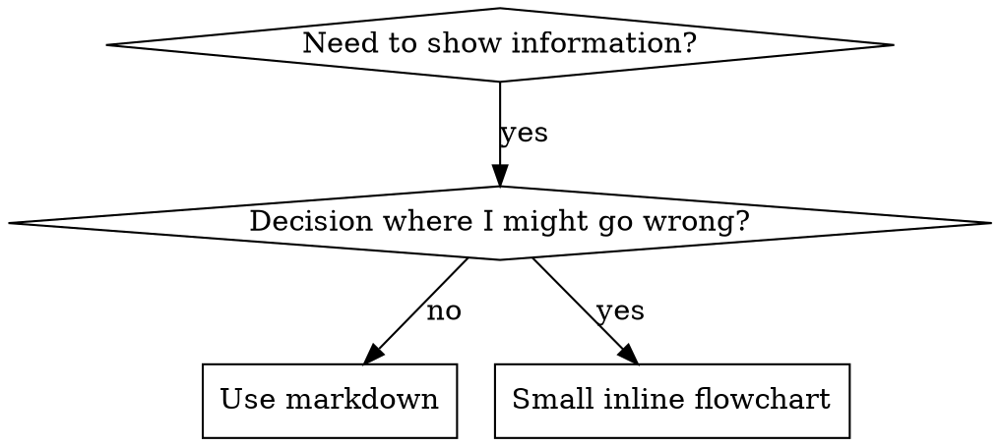

# Writing Skills

## Overview

**Writing skills 是将 Test-Driven Development 应用于 process documentation。**

**Personal skills 位于 runtime 的 skills directory**（Claude Code 上为 `~/.claude/skills/`）— 这些 runtime 上的路径见 [codex-tools.md](../using-superpowers/references/codex-tools.md) 或 [gemini-tools.md](../using-superpowers/references/gemini-tools.md)。Codex、Copilot CLI 和 Gemini CLI 也将 `~/.agents/skills/` 识别为 cross-runtime alias。

你编写 test cases（pressure scenarios with subagents），watch them fail（baseline behavior），编写 skill（documentation），watch tests pass（agents comply），并 refactor（close loopholes）。

**Core principle:** 若未 watch agent fail without the skill，你不知道 skill 是否 teaches the right thing。

**REQUIRED BACKGROUND:** 使用本 skill 前 MUST understand superpowers:test-driven-development。该 skill 定义 fundamental RED-GREEN-REFACTOR cycle。本 skill 将 TDD 适配到 documentation。

**Official guidance:** Anthropic 官方 skill authoring best practices 见 anthropic-best-practices.md。本文档提供补充 patterns 和 guidelines，与本 skill 的 TDD-focused approach 互补。

## What is a Skill?

**Skill** 是 proven techniques、patterns 或 tools 的 reference guide。Skills 帮助 future agents 找到并 apply effective approaches。

**Skills are:** Reusable techniques, patterns, tools, reference guides

**Skills are NOT:** 关于你 once 如何解决某问题的 narratives

## TDD Mapping for Skills

| TDD Concept | Skill Creation |
|-------------|----------------|
| **Test case** | Pressure scenario with subagent |
| **Production code** | Skill document (SKILL.md) |
| **Test fails (RED)** | Agent violates rule without skill (baseline) |
| **Test passes (GREEN)** | Agent complies with skill present |
| **Refactor** | Close loopholes while maintaining compliance |
| **Write test first** | Run baseline scenario BEFORE writing skill |
| **Watch it fail** | Document exact rationalizations agent uses |
| **Minimal code** | Write skill addressing those specific violations |
| **Watch it pass** | Verify agent now complies |
| **Refactor cycle** | Find new rationalizations → plug → re-verify |

整个 skill creation process 遵循 RED-GREEN-REFACTOR。

## When to Create a Skill

**Create when:**
- Technique 对你不 intuitively obvious
- 你会跨 projects 再次 reference
- Pattern 广泛适用（非 project-specific）
- Others would benefit

**Don't create for:**
- One-off solutions
- 已在别处 well-documented 的 standard practices
- Project-specific conventions（放入 instructions file）
- Mechanical constraints（若可用 regex/validation enforce，automate it — documentation 留给 judgment calls）

## Skill Types

### Technique
带 steps 的 concrete method（condition-based-waiting, root-cause-tracing）

### Pattern
思考 problems 的方式（flatten-with-flags, test-invariants）

### Reference
API docs、syntax guides、tool documentation（office docs）

## Directory Structure


```
skills/
  skill-name/
    SKILL.md              # Main reference (required)
    supporting-file.*     # Only if needed
```

**Flat namespace** — 所有 skills 在一个 searchable namespace

**Separate files for:**
1. **Heavy reference**（100+ lines）— API docs、comprehensive syntax
2. **Reusable tools** — Scripts、utilities、templates

**Keep inline:**
- Principles and concepts
- Code patterns (< 50 lines)
- Everything else

## SKILL.md Structure

**Frontmatter (YAML):**
- 两个 required fields：`name` 和 `description`（所有 supported fields 见 [agentskills.io/specification](https://agentskills.io/specification)）
- Max 1024 characters total
- `name`：仅使用 letters、numbers 和 hyphens（无 parentheses、special chars）
- `description`：Third-person，仅描述 when to use（NOT what it does）
  - 以 "Use when..." 开头，聚焦 triggering conditions
  - Include specific symptoms、situations 和 contexts
  - **NEVER summarize the skill's process or workflow**（原因见 SDO section）
  - 尽可能 Keep under 500 characters

```markdown
---
name: Skill-Name-With-Hyphens
description: Use when [specific triggering conditions and symptoms]
---

# Skill Name

## Overview
What is this? Core principle in 1-2 sentences.

## When to Use
[Small inline flowchart IF decision non-obvious]

Bullet list with SYMPTOMS and use cases
When NOT to use

## Core Pattern (for techniques/patterns)
Before/after code comparison

## Quick Reference
Table or bullets for scanning common operations

## Implementation
Inline code for simple patterns
Link to file for heavy reference or reusable tools

## Common Mistakes
What goes wrong + fixes

## Real-World Impact (optional)
Concrete results
```


## Skill Discovery Optimization (SDO)

**Critical for discovery:** Future agents 需要 FIND your skill

### 1. Rich Description Field

**Purpose:** Agent 读 description 决定为 given task load 哪些 skills。让它回答："Should I read this skill right now?"

**Format:** 以 "Use when..." 开头，聚焦 triggering conditions

**CRITICAL: Description = When to Use, NOT What the Skill Does**

Description 应 ONLY 描述 triggering conditions。Do NOT summarize the skill's process or workflow in the description。

**Why this matters:** Testing 显示当 description summarizes skill 的 workflow 时，agent 可能 follow description 而非读 full skill content。Description 说 "code review between tasks" 导致 agent 只做 ONE review，尽管 skill 的 flowchart 清楚显示 TWO reviews（spec compliance then code quality）。

当 description 改为仅 "Use when executing implementation plans with independent tasks"（无 workflow summary）时，agent 正确读了 flowchart 并 followed two-stage review process。

**The trap:** Summarize workflow 的 descriptions 创建 agents 会走的 shortcut。Skill body 变成 agents skip 的 documentation。

```yaml
# ❌ BAD: Summarizes workflow - agents may follow this instead of reading skill
description: Use when executing plans - dispatches subagent per task with code review between tasks

# ❌ BAD: Too much process detail
description: Use for TDD - write test first, watch it fail, write minimal code, refactor

# ✅ GOOD: Just triggering conditions, no workflow summary
description: Use when executing implementation plans with independent tasks in the current session

# ✅ GOOD: Triggering conditions only
description: Use when implementing any feature or bugfix, before writing implementation code
```

**Content:**
- 使用 concrete triggers、symptoms、situations 表明 skill 适用
- 描述 *problem*（race conditions、inconsistent behavior）而非 *language-specific symptoms*（setTimeout、sleep）
- Keep triggers technology-agnostic，除非 skill 本身是 technology-specific
- 若 skill 是 technology-specific，在 trigger 中 make explicit
- Write in third person（injected into system prompt）
- **NEVER summarize the skill's process or workflow**

```yaml
# ❌ BAD: Too abstract, vague, doesn't include when to use
description: For async testing

# ❌ BAD: First person
description: I can help you with async tests when they're flaky

# ❌ BAD: Mentions technology but skill isn't specific to it
description: Use when tests use setTimeout/sleep and are flaky

# ✅ GOOD: Starts with "Use when", describes problem, no workflow
description: Use when tests have race conditions, timing dependencies, or pass/fail inconsistently

# ✅ GOOD: Technology-specific skill with explicit trigger
description: Use when using React Router and handling authentication redirects
```

### 2. Keyword Coverage

使用 agent 会 search 的词：
- Error messages: "Hook timed out", "ENOTEMPTY", "race condition"
- Symptoms: "flaky", "hanging", "zombie", "pollution"
- Synonyms: "timeout/hang/freeze", "cleanup/teardown/afterEach"
- Tools: Actual commands, library names, file types

### 3. Descriptive Naming

**Use active voice, verb-first:**
- ✅ `creating-skills` not `skill-creation`
- ✅ `condition-based-waiting` not `async-test-helpers`

### 4. Token Efficiency (Critical)

**Problem:** getting-started 和 frequently-referenced skills load 进 EVERY conversation。Every token counts。

**Target word counts:**
- getting-started workflows: <150 words each
- Frequently-loaded skills: <200 words total
- Other skills: <500 words（still be concise）

**Techniques:**

**Move details to tool help:**
```bash
# ❌ BAD: Document all flags in SKILL.md
search-conversations supports --text, --both, --after DATE, --before DATE, --limit N

# ✅ GOOD: Reference --help
search-conversations supports multiple modes and filters. Run --help for details.
```

**Use cross-references:**
```markdown
# ❌ BAD: Repeat workflow details
When searching, dispatch subagent with template...
[20 lines of repeated instructions]

# ✅ GOOD: Reference other skill
Always use subagents (50-100x context savings). REQUIRED: Use [other-skill-name] for workflow.
```

**Compress examples:**
```markdown
# ❌ BAD: Verbose example (42 words)
your human partner: "How did we handle authentication errors in React Router before?"
You: I'll search past conversations for React Router authentication patterns.
[Dispatch subagent with search query: "React Router authentication error handling 401"]

# ✅ GOOD: Minimal example (20 words)
Partner: "How did we handle auth errors in React Router?"
You: Searching...
[Dispatch subagent → synthesis]
```

**Eliminate redundancy:**
- Don't repeat what's in cross-referenced skills
- Don't explain what's obvious from command
- Don't include multiple examples of same pattern

**Verification:**
```bash
wc -w skills/path/SKILL.md
# getting-started workflows: aim for <150 each
# Other frequently-loaded: aim for <200 total
```

**Name by what you DO or core insight:**
- ✅ `condition-based-waiting` > `async-test-helpers`
- ✅ `using-skills` not `skill-usage`
- ✅ `flatten-with-flags` > `data-structure-refactoring`
- ✅ `root-cause-tracing` > `debugging-techniques`

**Gerunds (-ing) work well for processes:**
- `creating-skills`, `testing-skills`, `debugging-with-logs`
- Active，描述你正在 taking 的 action

### 5. Cross-Referencing Other Skills

**When writing documentation that references other skills:**

使用 skill name only，带 explicit requirement markers：
- ✅ Good: `**REQUIRED SUB-SKILL:** Use superpowers:test-driven-development`
- ✅ Good: `**REQUIRED BACKGROUND:** You MUST understand superpowers:systematic-debugging`
- ❌ Bad: `See skills/testing/test-driven-development`（unclear if required）
- ❌ Bad: `@skills/testing/test-driven-development/SKILL.md`（force-loads, burns context）

**Why no @ links:** `@` syntax force-loads files immediately，在你需要之前消耗 200k+ context。

## Flowchart Usage



**Use flowcharts ONLY for:**
- Non-obvious decision points
- Process loops where you might stop too early
- "When to use A vs B" decisions

**Never use flowcharts for:**
- Reference material → Tables, lists
- Code examples → Markdown blocks
- Linear instructions → Numbered lists
- Labels without semantic meaning (step1, helper2)

Graphviz style rules 见本目录 `graphviz-conventions.dot`。

**Visualizing for your human partner:** 用本目录 `render-graphs.js` 将 skill 的 flowcharts 渲染为 SVG：
```bash
./render-graphs.js ../some-skill           # Each diagram separately
./render-graphs.js ../some-skill --combine # All diagrams in one SVG
```

## Code Examples

**One excellent example beats many mediocre ones**

Choose most relevant language:
- Testing techniques → TypeScript/JavaScript
- System debugging → Shell/Python
- Data processing → Python

**Good example:**
- Complete and runnable
- Well-commented explaining WHY
- From real scenario
- Shows pattern clearly
- Ready to adapt (not generic template)

**Don't:**
- Implement in 5+ languages
- Create fill-in-the-blank templates
- Write contrived examples

You're good at porting - one great example is enough.

## File Organization

### Self-Contained Skill
```
defense-in-depth/
  SKILL.md    # Everything inline
```
When: All content fits, no heavy reference needed

### Skill with Reusable Tool
```
condition-based-waiting/
  SKILL.md    # Overview + patterns
  example.ts  # Working helpers to adapt
```
When: Tool 是可复用 code，不只是 narrative

### Skill with Heavy Reference
```
pptx/
  SKILL.md       # Overview + workflows
  pptxgenjs.md   # 600 lines API reference
  ooxml.md       # 500 lines XML structure
  scripts/       # Executable tools
```
When: Reference material 太大无法 inline

## The Iron Law (Same as TDD)

```
NO SKILL WITHOUT A FAILING TEST FIRST
```

适用于 NEW skills AND 对 existing skills 的 EDITS。

Test 之前写 skill？Delete it. Start over.
未 testing 就 edit skill？Same violation.

**No exceptions:**
- Not for "simple additions"
- Not for "just adding a section"
- Not for "documentation updates"
- Don't keep untested changes as "reference"
- Don't "adapt" while running tests
- Delete means delete

**REQUIRED BACKGROUND:** superpowers:test-driven-development skill 解释 why this matters。Same principles apply to documentation。

## Testing All Skill Types

不同 skill types 需要不同 test approaches：

### Discipline-Enforcing Skills (rules/requirements)

**Examples:** TDD, verification-before-completion, designing-before-coding

**Test with:**
- Academic questions: 他们理解 rules 吗？
- Pressure scenarios: 压力下 comply 吗？
- Multiple pressures combined: time + sunk cost + exhaustion
- Identify rationalizations 并 add explicit counters

**Success criteria:** Agent follows rule under maximum pressure

### Technique Skills (how-to guides)

**Examples:** condition-based-waiting, root-cause-tracing, defensive-programming

**Test with:**
- Application scenarios: 能正确 apply technique 吗？
- Variation scenarios: 处理 edge cases 吗？
- Missing information tests: instructions 有 gaps 吗？

**Success criteria:** Agent successfully applies technique to new scenario

### Pattern Skills (mental models)

**Examples:** reducing-complexity, information-hiding concepts

**Test with:**
- Recognition scenarios: 识别 pattern 何时适用吗？
- Application scenarios: 能使用 mental model 吗？
- Counter-examples: 知道何时 NOT apply 吗？

**Success criteria:** Agent correctly identifies when/how to apply pattern

### Reference Skills (documentation/APIs)

**Examples:** API documentation, command references, library guides

**Test with:**
- Retrieval scenarios: 能找到 right information 吗？
- Application scenarios: 能正确使用找到的内容吗？
- Gap testing: common use cases 覆盖了吗？

**Success criteria:** Agent finds and correctly applies reference information

## Common Rationalizations for Skipping Testing

| Excuse | Reality |
|--------|---------|
| "Skill is obviously clear" | Clear to you ≠ clear to other agents. Test it. |
| "It's just a reference" | References 可能有 gaps、unclear sections。Test retrieval. |
| "Testing is overkill" | Untested skills have issues. Always. 15 min testing saves hours. |
| "I'll test if problems emerge" | Problems = agents can't use skill. Test BEFORE deploying. |
| "Too tedious to test" | Testing 比 production 中 debug bad skill 更不 tedious。 |
| "I'm confident it's good" | Overconfidence guarantees issues. Test anyway. |
| "Academic review is enough" | Reading ≠ using. Test application scenarios. |
| "No time to test" | Deploying untested skill 浪费更多 time fixing it later. |

**All of these mean: Test before deploying. No exceptions.**

## Match the Form to the Failure

写 guidance 之前，classify baseline failure。Bulletproofs 一种 failure type 的 form 对另一种会 measurably backfire。

| Baseline failure | Right form | Wrong form |
|---|---|---|
| Skips/violates a rule under pressure (knows better, does it anyway) | Prohibition + rationalization table + red flags (see Bulletproofing below) | Soft guidance ("prefer...", "consider...") |
| Complies, but output has the wrong shape (bloated prompt, buried verdict, restated spec) | Positive recipe or contract: state what the output IS — its parts, in order | Prohibition list ("don't restate", "never narrate") |
| Omits a required element from something they already produce | Structural: REQUIRED field or slot in the template they fill in | Prose reminders near the template |
| Behavior should depend on a condition | Conditional keyed to an observable predicate ("if the brief exists, reference it") | Unconditional rule + exemption clauses |

**Why prohibitions backfire on shaping problems:** 在 competing incentive（"make the prompt self-contained"）下，agents 与 "don't X" negotiate。在 dispatch-prompt guidance 的 head-to-head wording tests 中，prohibition arm 明显产生比 recipe arm 更多的 unwanted content（fully separated distributions），且 trended worse than even no-guidance control — micro-test your own case rather than assuming，但 never reach for prohibition by default。Recipe 无可 negotiate：output 匹配 stated shape 或不匹配。

**Rules for whichever form you pick:**
- **No nuance clauses.** "Don't X unless it matters" reopens negotiation — 向 winning recipe append 单个 nuance clause 在同一 wording tests 中将其从 consistent 降为 noisy。将 real exception 表达为 observable predicate 上的独立 conditional。
- **Exemption clauses don't scope.** "This limit doesn't apply to code blocks" 仍 suppresses code blocks。若 output 部分必须 exempt，restructure 使 rule 无法 reach it。

## Bulletproofing Skills Against Rationalization

Enforce discipline 的 skills（如 TDD）需要 resist rationalization。Agents are smart，压力下会 find loopholes。

**Scope:** 此 toolkit 用于 discipline failures — agent 知道 rule 却在压力下 skip。对于 wrong-shaped output 或 omitted elements，prohibition-based bulletproofing backfires；改用 Match the Form to the Failure 中的 forms。

**Psychology note:** 理解 WHY persuasion techniques work 有助于 systematically apply。Research foundation（Cialdini, 2021; Meincke et al., 2025）见 persuasion-principles.md，关于 authority、commitment、scarcity、social proof、unity principles。

### Close Every Loophole Explicitly

Don't just state the rule - forbid specific workarounds：

<Bad>
```markdown
Write code before test? Delete it.
```
</Bad>

<Good>
```markdown
Write code before test? Delete it. Start over.

**No exceptions:**
- Don't keep it as "reference"
- Don't "adapt" it while writing tests
- Don't look at it
- Delete means delete
```
</Good>

### Address "Spirit vs Letter" Arguments

Early add foundational principle：

```markdown
**Violating the letter of the rules is violating the spirit of the rules.**
```

This cuts off entire class of "I'm following the spirit" rationalizations.

### Build Rationalization Table

从 baseline testing capture rationalizations（见下方 Testing section）。Agents 的 every excuse 进 table：

```markdown
| Excuse | Reality |
|--------|---------|
| "Too simple to test" | Simple code breaks. Test takes 30 seconds. |
| "I'll test after" | Tests passing immediately prove nothing. |
| "Tests after achieve same goals" | Tests-after = "what does this do?" Tests-first = "what should this do?" |
```

### Create Red Flags List

Make it easy for agents to self-check when rationalizing：

```markdown
## Red Flags - STOP and Start Over

- Code before test
- "I already manually tested it"
- "Tests after achieve the same purpose"
- "It's about spirit not ritual"
- "This is different because..."

**All of these mean: Delete code. Start over with TDD.**
```

### Update SDO for Violation Symptoms

Add to description: 你 ABOUT to violate rule 时的 symptoms：

```yaml
description: use when implementing any feature or bugfix, before writing implementation code
```

## RED-GREEN-REFACTOR for Skills

Follow the TDD cycle：

### RED: Write Failing Test (Baseline)

WITHOUT skill 用 subagent 运行 pressure scenario。Document exact behavior:
- What choices did they make?
- What rationalizations did they use (verbatim)?
- Which pressures triggered violations?

This is "watch the test fail" - 写 skill 前 must see agents 自然做什么。

### GREEN: Write Minimal Skill

Write skill addressing those specific rationalizations。Don't add extra content for hypothetical cases.

WITH skill 运行 same scenarios。Agent should now comply.

### REFACTOR: Close Loopholes

Agent found new rationalization? Add explicit counter. Re-test until bulletproof.

### Micro-Test Wording Before Full Scenarios

Full pressure-scenario runs 是 final gate，但 slow and expensive per iteration。先用 micro-tests verify wording itself：

1. **One fresh-context sample per call** — raw API call，或无 API access 时 single-shot subagent。System prompt = guidance 将 live 的 realistic context（full skill 或 prompt template，非 guidance in isolation）；user message = 诱惑 failure 的 task。
2. **Always include a no-guidance control.** 若 control 不 exhibit failure，nothing to fix — stop，don't author guidance。
3. **5+ reps per variant.** Single samples lie.
4. **Manually read every flagged match.** 可 programmatically score，但 template echoes 和 quoted counter-examples masquerade as hits；automated counts alone overstate both failure and success。
5. **Variance is a metric.** Guidance lands 时 reps converge on same shape。Five reps 五种 interpretations 意味着 wording isn't binding — tighten form before adding words。

Micro-tests verify wording；不 replace discipline skills 的 pressure scenarios。

**Testing methodology:** 完整 testing methodology 见 [testing-skills-with-subagents.md](testing-skills-with-subagents.md)：
- How to write pressure scenarios
- Pressure types (time, sunk cost, authority, exhaustion)
- Plugging holes systematically
- Meta-testing techniques

## Anti-Patterns

### ❌ Narrative Example
"In session 2025-10-03, we found empty projectDir caused..."
**Why bad:** Too specific, not reusable

### ❌ Multi-Language Dilution
example-js.js, example-py.py, example-go.go
**Why bad:** Mediocre quality, maintenance burden

### ❌ Code in Flowcharts
```dot
step1 [label="import fs"];
step2 [label="read file"];
```
**Why bad:** Can't copy-paste, hard to read

### ❌ Generic Labels
helper1, helper2, step3, pattern4
**Why bad:** Labels should have semantic meaning

## STOP: Before Moving to Next Skill

**After writing ANY skill, you MUST STOP and complete the deployment process.**

**Do NOT:**
- Create multiple skills in batch without testing each
- Move to next skill before current one is verified
- Skip testing because "batching is more efficient"

**下方 deployment checklist 对 EACH skill MANDATORY。**

Deploying untested skills = deploying untested code。Violation of quality standards。

## Skill Creation Checklist (TDD Adapted)

**IMPORTANT: 为下方 EACH checklist item 创建 todo。**

**RED Phase - Write Failing Test:**
- [ ] Create pressure scenarios (3+ combined pressures for discipline skills)
- [ ] Run scenarios WITHOUT skill - document baseline behavior verbatim
- [ ] Identify patterns in rationalizations/failures

**GREEN Phase - Write Minimal Skill:**
- [ ] Name uses only letters, numbers, hyphens (no parentheses/special chars)
- [ ] YAML frontmatter with required `name` and `description` fields (max 1024 chars; see [spec](https://agentskills.io/specification))
- [ ] Description starts with "Use when..." and includes specific triggers/symptoms
- [ ] Description written in third person
- [ ] Keywords throughout for search (errors, symptoms, tools)
- [ ] Clear overview with core principle
- [ ] Address specific baseline failures identified in RED
- [ ] Guidance form matches the failure type (see Match the Form to the Failure)
- [ ] For behavior-shaping guidance: wording micro-tested against a no-guidance control (5+ reps, every flagged match read manually) — N/A for pure reference skills
- [ ] Code inline OR link to separate file
- [ ] One excellent example (not multi-language)
- [ ] Run scenarios WITH skill - verify agents now comply

**REFACTOR Phase - Close Loopholes:**
- [ ] Identify NEW rationalizations from testing
- [ ] Add explicit counters (if discipline skill)
- [ ] Build rationalization table from all test iterations
- [ ] Create red flags list
- [ ] Re-test until bulletproof

**Quality Checks:**
- [ ] Small flowchart only if decision non-obvious
- [ ] Quick reference table
- [ ] Common mistakes section
- [ ] No narrative storytelling
- [ ] Supporting files only for tools or heavy reference

**Deployment:**
- [ ] Commit skill to git and push to your fork (if configured)
- [ ] Consider contributing back via PR (if broadly useful)

## Discovery Workflow

Future agents 如何 find your skill：

1. **Encounters problem** ("tests are flaky")
2. **Searches skills** (greps descriptions, browses categories)
3. **Finds SKILL** (description matches)
4. **Scans overview** (is this relevant?)
5. **Reads patterns** (quick reference table)
6. **Loads example** (only when implementing)

**Optimize for this flow** - put searchable terms early and often.
